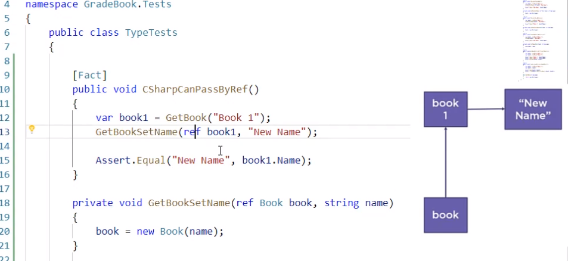

# My First c#

I am following an intro to c# "c# Fundamentals" tutorial by Scott Allen on Plurasight.


# My Notes from the tutoral  
## Reference Types vs Value Types

**Reference types**
Any time you use a class provided by .Net you are using what is known as a **reference type**  

eg: `var b = new Book("Grades");`  

the line of code will force the .Net run time to create a space in the computer memory for the variable b because we need memory to store values that are inside of variables. By the time that statemente finishes executing there will be a value(lets say 1072) in the letter b. The value represensts a memory location (on the megabytes and gigabytes of your computer), there will be memory cells where the .Net run time allocates space for this new book object that you want to create. The value 1072 is the 'address' or location of where the book is in those gigabytes gigabytes that are available. We talk about the variable b being a reference to where the book is stored on the memory of your computer. Your computer then uses this variable as a reference for where the book is stored in memory.  
Fields are similarly, also references to location in memory.  

**Value types**  
Intergers are special types in .Net, they are what is known as value types because for a value type the runtime still creates space for the variable x. But instead of creating a 'refrence' to an address inside of the variable, it stores the value itself and it is stored directly in that variable.  
eg: `var x = 3;`
The following are value types: floats, integers, doubles, DateTime, bool, Struct
All Structs are value types. You can check the type in Visual Studio Code by putting your cursor on the type and then hitting f12.  

Classes and strings are reference types but String is a special case because it behaves like a value type.

NOTE: LOOK INTO Struct vs Class

## Pass by Reference vs Pass by Value  

These terms describe how a perameter is given to some method that you are invoking.  
In the C# language, when you pass a parameter to a method you are ALWAYS passing a perameter by value (unless you specify with keywords). What that means is that I am taking the value from (see below example) book1 and I am copying that and placing it into the perameter Book. The value represents a pointer to a memory location so it is a reference to a book object.  

That would be very different in a language where they pass perameters by reference because then they would recieve a reference to variable book1 and the perameter could still make changes to the book1 object because the perameter holds a reference to a variable that still holds a reference to my book object. But in a pass by reference scenario, I can even make chages to that book1 varaible itself from the other method and that is something that CANNOT happen if I use 'pass by value'.

Example:  
```
        [Fact]
        public void CanSetNameFromReference()
        {
            var book1 = GetBook("Book 1");
            SetName(book1, "New Name");

            Assert.Equal("New Name", book1.Name);
        }

        private void SetName(Book book1, string name)
        {
            book1.Name = name;
        }
  ```
        


**Pass By Reference**  
You can do a pass by reference using the "ref" or "out" keywords.  
The difference between "ref" and "out" is that with the "out" keyword the C# compiler assumes that the incoming reference has not been initialised. Therefore it will be an error if you do not assign to an "out" perameter because it expects something assigned to the output perameter, it is like leaving an uninitialised variable around.




## Solution files  

Solution files help you to build and run test for the whole project (not just per directory within the project) in one go. It keeps track of the whole project in one go. 

To create a solution file type into terminal:  
`dotnet new sln`  
You can add projects to the solution with commands like:  
`dotnet sln add src/GradeBook/GradeBook.csproj`  


## Garbage Collection in .Net runtime

You do not need to tell the runtime to delete an object to free up memory space as .Net has a garbage collector. It will keep track of all the objects that you have allocated and created and it tracks variables and fields. The .Net runtime knows when there is an object in memory and knows that if it has no variables or fields pointing to or using that object that the object is no longer in use and that it can run a garbage collection to free up memory so that your program doesn't exhaust memory. 

